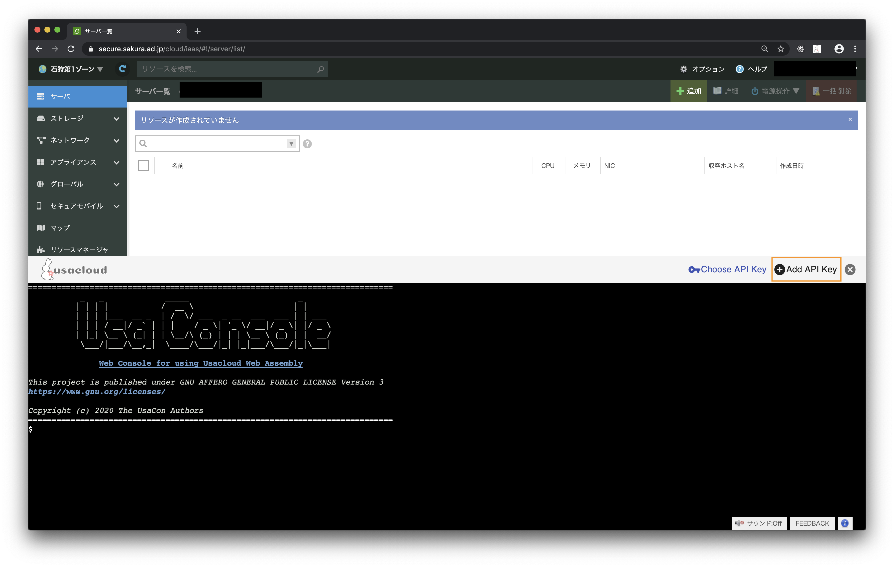
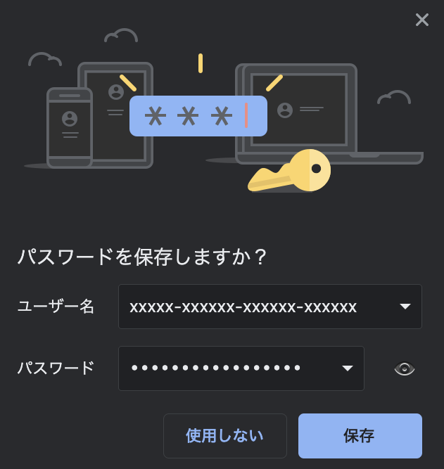
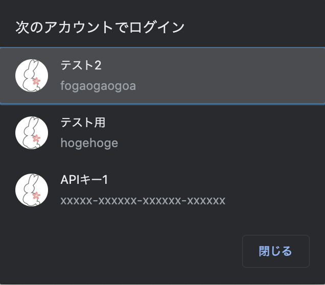

# usacon日本語ドキュメント

A browser extension for using SakuraCloud CLI in the control panel.

`Usacon`は[さくらのクラウド](https://cloud.sakura.ad.jp)のコントロールパネル上でCLIである[Usacloud](https://github.com/sacloud/usacloud)を
利用できるようにするChrome拡張です。  
WebAssemblyを利用しており別途サーバを必要とせずにブラウザだけでUsacloudコマンドが実行可能になります。

[https://github.com/sacloud/usacon](https://github.com/sacloud/usacon)


---

- [Install / インストール](#install)
    - [From Chrome Web Store / Chromeウェブストアから](#from_chrome_web_store)
    - [From source code / ソースコードから (for a developer)](#from_source_code)
- [Usage / 使い方](#usage)
    - [コンソールの表示](#show_console)
    - [APIキーの登録](#add_api_key)
    - [APIキーの選択](#choose_api_key)
    - [APIキーの選択解除](#unselect_api_key)
    - [コンソールの操作](#console_usage)
        - [コマンド](#console_commands)
        - [キーボードショートカット](#keyboard_shortcut)
- [Usacloudとの違い](#diff)
---

## Install {: #install }

### From Chrome Web Store / Chromeウェブストアから {: #from_chrome_web_store }

[https://chrome.google.com/webstore/detail/usacon/ihcpjahhejhblhadomiffpnfmfaklpeh](https://chrome.google.com/webstore/detail/usacon/ihcpjahhejhblhadomiffpnfmfaklpeh)

### From source code / ソースコードから (for a developer) {: #from_source_code }

1: ブラウザ拡張のビルド

```
$ git clone https://github.com/sacloud/usacon.git
$ cd usacon
$ make tools release-build

# ./dist配下にファイル一式が出力される
```

2: Chromeへインストール

- Chromeで`chrome://extensions`を開く
- `パッケージ化されていない拡張機能を読み込む`をクリック
- 1で出力された`dist`ディレクトリを指定

## Usage {: #usage }

UsaConはさくらのクラウドのコントロールパネルのうち、IaaS部分でのみ利用可能です。  
具体的には`https://secure.sakura.ad.jp/cloud/iaas`を開いている場合が対象となります。

### コンソールの表示 {: #show_console }

ブラウザ右上に表示されているのUsaConのブラウザ拡張アイコンをクリックするとコンソールの表示/非表示が切り替わります。


### APIキーの登録 {: #add_api_key }

`Add API Key`ボタンをクリックするとAPI入力画面が表示されます。


入力して`Save To The Browser`ボタンをクリックするとブラウザにAPIキーを保存するダイアログが表示されます。



** Note: もしダイアログが表示されない場合はURLバーの右側の鍵アイコンをクリックすると表示されることがあります **

### APIキーの選択 {: #choose_api_key }

`Choose API Key`ボタンをクリックするとブラウザに保存済みのAPIキーの選択ダイアログが表示されます。



!!! tip
    既に`secure.sakura.ad.jp`でログインパスワードなどを保存済みの場合、上記で登録したAPIキー以外の候補も表示されます。   
    このためUsaconで登録したAPIキーには目印としてUsacloudアイコンを見出しに設定しています。

!!! warning
    既にUsaconでAPIキーを登録している場合、登録されている全てのAPIキーが候補として表示されます。  
    現在コントロールパネルにログインしているアカウントとは別のアカウントと紐づけられたAPIキーの場合でも一覧表示される点にご注意ください。

### APIキーの選択解除 {: #unselect_api_key }

APIキーを選択した状態だと保存時に指定したAPIキーの名前がツールバーに表示されています。  
APIキーの名前をクリックすることで選択解除が行えます。


### コンソールの操作 {: #console_usage }

#### コマンド {: #console_commands }

以下のコマンドが利用可能です。

- `usacloud`
- `echo`
- `env`
- `clear` or `cls`

#### キーボードショートカット {: #keyboard_shortcut }

bash風のキーボードショートカットが利用可能です。

- `↑` または `↓`: ヒストリーの表示
- `tab`: (未実装) オートコンプリート
- `ctrl + c`: 実行中のコマンドの終了
- `ctrl + z`: 実行中のコマンドの中断(現在は`ctrl + c`と同等の処理)
- `ctrl + l`: 画面のクリア

- `ctrl + a`: カーソルを行頭へ移動
- `ctrl + e`: カーソルを行末へ移動
- `ctrl + b`: カーソルを1文字前へ移動
- `ctrl + f`: カーソルを1文字後ろへ移動

## Usacloudとの違い {: #diff }

#### 使用できないコマンド

以下のコマンドは利用できません。

- `usacloud config`(`profile`)
- `usacloud server ssh`
- `usacloud server rdp`
- `usacloud server vnc`
- `usacloud self`

#### 使用できないコマンドラインオプション

以下のオプションは利用できません。

- `--profile`
- `--zones`
- `--trace`
- `--fake-store`

